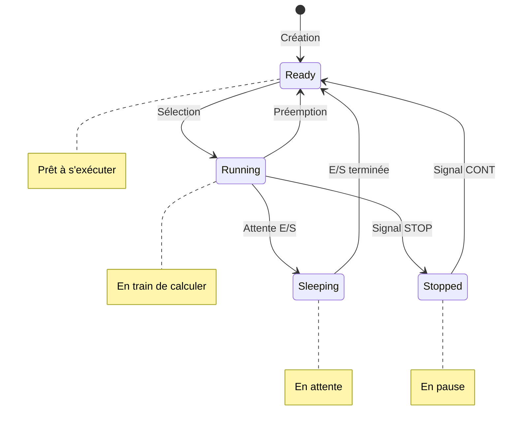

# Scénario 3 : Explorer les états des processus

Imaginez que vous êtes un détective qui observe le comportement des processus sur votre système. Dans ce scénario, nous allons découvrir comment les processus « vivent » dans Linux, quels états ils peuvent prendre, et comment nous pouvons les observer et les influencer.

## Objectifs d'apprentissage

À la fin de ce scénario, vous serez capable de :

- Comprendre ce qu’est l’état d’un processus et pourquoi il change
- Utiliser des outils pour observer ces états
- Manipuler l’état d’un processus de manière basique

## Préparation : Notre laboratoire d’observation

Pour mener nos expériences, nous allons utiliser deux outils :

1. **Le programme procstate** : Un programme spécial qui va nous montrer de manière visible les différents états d’un processus. C’est comme une petite souris de laboratoire qui va nous aider à comprendre le comportement des processus.

2. **Terminator** : Notre « laboratoire » avec deux zones d’observation :
   - À gauche : pour exécuter notre programme
   - À droite : pour l’observer avec différents outils

### Mise en place du laboratoire

1. Ouvrez Terminator
2. Appuyez sur ++ctrl+shift+e++ pour diviser la fenêtre verticalement
3. Vous avez maintenant deux terminaux côte à côte

## Partie 1 : Premiers pas dans l’observation des processus

### Le PID : La carte d’identité d’un processus

Avant de commencer nos observations, nous devons comprendre comment identifier un processus. Sous Linux, chaque processus reçoit un numéro unique appelé PID (*Process IDentifier*). C’est comme un numéro de sécurité sociale pour les processus — il est unique et permet de les identifier sans ambiguïté.

Dans le terminal de gauche, lancez notre programme d’observation :

```bash
./procstate
```

Vous devriez voir quelque chose comme :

```
[Début] PID = 1234
Ce programme alterne 5 s de calcul intensif (BUSY) et 3 s de sommeil (SLEEP).
```

!!! question "Réflexion initiale"
    Commencez par observer le PID affiché lorsque le programme est lancé. Voici les étapes à suivre pour vérifier si le PID change à chaque exécution :
    
    1. Notez le PID actuel affiché à l’écran.
    2. Arrêtez le programme en utilisant la combinaison de touches ++ctrl+c++.
    3. Relancez le programme et comparez le PID affiché avec celui noté précédemment.

    **Question :** Le PID est-il identique à chaque lancement ?

    Ensuite, réfléchissez à la question suivante : pourquoi pensez-vous que chaque processus a besoin d’un identifiant unique ?


### À la recherche du PID perdu

Si vous perdez le PID de vue ou si vous lancez plusieurs instances du programme, Linux fournit un outil très pratique pour retrouver les PID : la commande `pidof`. Elle fait exactement ce que son nom suggère — elle trouve le PID d’un programme à partir de son nom.

Dans le terminal de droite, exécutez :

```bash
pidof procstate
```

!!! note "Comment fonctionne pidof"
    La commande `pidof` cherche dans la liste des processus en cours d’exécution et affiche les PID des processus qui correspondent au nom donné. C’est comme demander : « Qui s’appelle procstate parmi les processus en cours ? »
    
    Si vous lancez plusieurs fois le même programme, `pidof` affichera plusieurs PID, un pour chaque instance en cours d'exécution.

### La magie de la substitution de commande

Dans le shell Linux, nous pouvons utiliser le résultat d’une commande directement dans une autre commande. C’est ce qu’on appelle la substitution de commande, et elle se fait avec la syntaxe `$(commande)`.

Essayons de comprendre avec un exemple simple. Dans le terminal de droite, tapez :

```bash
echo "Bonjour, nous sommes le $(date)"
```

Dans cette commande :

1. Le shell exécute d’abord la commande entre `$( )`
2. Il remplace ensuite toute l'expression $(date) par son résultat
3. Finalement, il exécute la commande echo avec le texte substitué

C'est comme si vous disiez au shell : "Là où tu vois $(commande), remplace-le par ce que cette commande afficherait si tu l'exécutais."

!!! exercise "Exercice : Comprendre la substitution"
    1. Exécutez ces deux commandes et comparez leurs résultats :
       ```bash
       echo "Le PID est $(pidof procstate)"
       echo "Le PID est pidof procstate"
       ```
    2. Quelle est la différence ? Pourquoi ?
    3. Inventez votre propre commande utilisant `$(...)` avec une autre commande Linux que vous connaissez.

## Partie 2 : Observer les états des processus

### Les états : Le cycle de vie d'un processus

Un processus n'est pas toujours en train de calculer. Comme nous les humains, il peut être dans différents états :

1. **En cours d'exécution** (*Running* - `R`) : 
   - Le processus est actuellement en train de calculer
   - Comme quand vous êtes concentré sur un calcul mental

2. **En sommeil** (*Sleeping* - `S`) :
   - Le processus attend quelque chose (une entrée, un timer...)
   - Comme quand vous attendez le bus - vous ne faites rien mais vous êtes prêt à réagir

3. **Suspendu** (*Stopped* - `T`) :
   - Le processus est temporairement arrêté
   - Comme quand vous mettez une vidéo en pause



Ce diagramme montre comment un processus passe d'un état à l'autre :

- Quand il est créé, il est d'abord prêt à s'exécuter
- Le système le sélectionne pour s'exécuter (état Running)
- S'il doit attendre quelque chose, il passe en Sleeping
- On peut le mettre en pause (Stopped) et le reprendre plus tard

### Notre outil d'observation : L'alias psess

Pour observer facilement les processus, nous allons créer un outil personnalisé. En Linux, on peut créer des raccourcis de commande appelés "alias". Voici un alias très utile pour observer les processus :

```bash
# Affiche les processus avec les colonnes essentielles pour une analyse rapide :
#   - PPID : PID du processus parent.
#   - PID  : Identifiant du processus.
#   - STAT : État du processus (Running, Sleeping, etc.).
#   - TTY  : Terminal associé au processus (ou ? si aucun).
#   - USER : Utilisateur propriétaire du processus.
#   - CMD  : Commande utilisée pour démarrer le processus.
alias psess='ps -o ppid,pid,stat,tty,user,cmd'
```

C'est comme créer notre propre loupe d'observation, spécialement adaptée pour voir ce qui nous intéresse dans les processus.

!!! tip "Conseil pratique"
    Pour garder cet outil toujours disponible, ajoutez cette ligne dans votre fichier `~/.bashrc`. 
    C'est comme ranger notre loupe dans un tiroir facilement accessible !

### Observer notre processus

Maintenant que nous avons notre outil, observons notre processus :

```bash
psess -p $(pidof procstate)
```

!!! exercise "Exercice d'observation"
    Observez pendant au moins 30 secondes et notez :
    1. Les différents états que vous voyez dans la colonne STAT
    2. À quel moment de l'affichage du programme ils correspondent
    3. Le PPID (Process Parent ID) - qui est le "parent" de notre processus ?

Analysons chaque colonne de la sortie :

- PPID : Le PID du processus qui a créé celui-ci (généralement votre shell)
- PID : L'identifiant unique de notre processus
- STAT : L'état actuel (R, S, ou T)
- TTY : Le terminal associé
- USER : Qui a lancé le processus
- CMD : La commande qui tourne

### Observation en temps réel avec htop

Pour une vue plus dynamique, nous pouvons utiliser htop :

```bash
htop -p $(pidof procstate)
```

htop nous montre :

- L'utilisation CPU en temps réel
- L'état du processus qui change
- La mémoire utilisée
- Et bien d'autres informations

!!! tip "Navigation dans htop"
    - ++f4++ : Filtre pour voir uniquement certains processus
    - ++q++ : Quitter htop
    - Les barres de couleur montrent l'intensité d'utilisation du CPU

## Partie 3 : Premiers pas dans la manipulation des processus

Maintenant que nous savons observer, essayons d'influencer le comportement de notre processus.

!!! warning "Note importante"
    Dans ce scénario, nous allons simplement voir comment "mettre en pause" un processus. Les signaux et la commande kill seront expliqués en détail dans les prochains scénarios. Pour l'instant, considérez les commandes suivantes comme des "formules magiques" que nous comprendrons mieux plus tard.

### Mettre un processus en pause

Dans le scénario précédent, nous avons vu comment suspendre un processus avec ++ctrl+z++ et le reprendre avec les commandes `fg` et `bg`. Ici, nous allons découvrir une autre méthode qui ne nécessite pas d'avoir accès au terminal où le processus s'exécute.

Pour suspendre temporairement notre processus depuis n'importe quel terminal :

```bash
kill -STOP $(pidof procstate)
```

Cette commande utilise la substitution que nous avons apprise précédemment pour envoyer un signal STOP au bon processus.

Vérifiez immédiatement l'état :

```bash
psess -p $(pidof procstate)
```

Vous devriez voir l'état 'T' (Stopped).

### Reprendre l'exécution

Pour faire reprendre le processus :

```bash
kill -CONT $(pidof procstate)
```

!!! exercise "Exercice final de synthèse"
    1. Lancez deux instances de procstate dans des terminaux différents
    2. Observez leurs états avec psess
    3. Mettez-en un en pause avec kill -STOP
    4. Que remarquez-vous ?
        - L'autre instance continue-t-elle de fonctionner ?
        - Les PID sont-ils différents ?
        - Les états sont-ils indépendants ?

## Conclusion et prochaines étapes

Nous avons découvert :

- Comment identifier un processus avec son PID
- Les différents états qu'un processus peut prendre
- Comment observer ces états
- Comment mettre en pause et reprendre un processus

Dans les prochains scénarios, nous approfondirons :

- Les signaux et la commande kill en détail
- Les états spéciaux comme les zombies
- Et bien d'autres aspects passionnants des processus Linux !

!!! question "Questions de réflexion finale"
    1. Pourquoi un processus passe-t-il en état Sleeping ?
    2. Un processus en état Stopped consomme-t-il du CPU ?
    3. Que pourrait-il se passer si on ferme le terminal d'un processus suspendu ?
