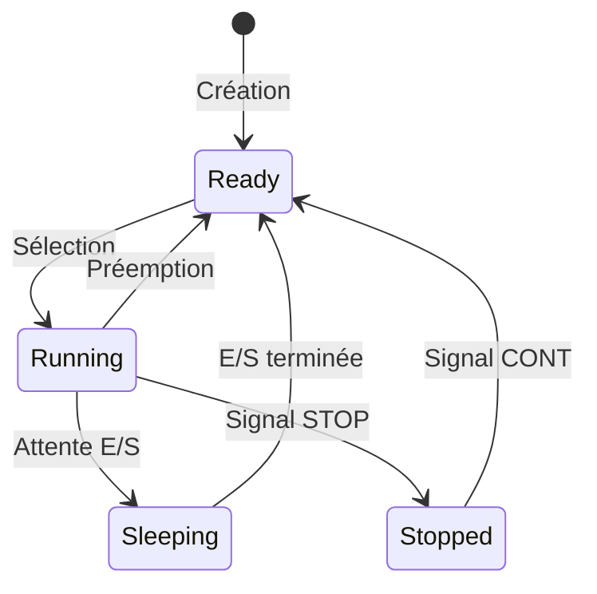

# Scénario 3 : Observer et manipuler les états des processus

Ce scénario vous permettra de découvrir comment les processus changent d'état au cours de leur exécution et comment observer et manipuler ces changements. Vous utiliserez un programme spécialement conçu pour illustrer les différents états qu'un processus peut prendre sous Linux.

## Objectifs d'apprentissage

À la fin de ce scénario, vous serez capable de :

- Identifier les différents états possibles d'un processus
- Utiliser les commandes système pour observer ces états
- Comprendre la différence entre les états Running, Sleeping et Stopped
- Manipuler l'état d'un processus à l'aide de signaux

## Concepts fondamentaux

### Les états des processus

Un **processus** (*process*) sous Linux peut se trouver dans différents états qui reflètent son activité actuelle. Les états principaux sont :

1. **En exécution** (*Running* - `R`) : Le processus utilise activement le processeur pour effectuer des calculs.
2. **En sommeil** (*Sleeping* - `S`) : Le processus attend un événement (entrée/sortie, timer, etc.).
3. **Suspendu** (*Stopped* - `T`) : Le processus a été temporairement arrêté, généralement par un signal.



### L'outil procstate

Pour ce scénario, nous utiliserons le programme `procstate` qui alterne entre deux phases distinctes :

1. Une phase **BUSY** où il effectue des calculs intensifs (état `R`)
2. Une phase **SLEEP** où il attend passivement (état `S`)

Ce comportement nous permettra d'observer facilement les transitions entre les états.

## Mise en pratique

### Préparation de l'environnement

1. Lancez Terminator et divisez la fenêtre en deux parties verticales (++ctrl+shift+e++)
2. Dans le terminal de gauche, nous exécuterons `procstate`
3. Dans le terminal de droite, nous observerons son comportement

### Étape 1 : Lancement et identification

Dans le terminal de gauche, lancez le programme :

```bash
./procstate
```

Le programme affiche son PID et commence à alterner entre ses phases BUSY et SLEEP.

!!! question "Réflexion"
    1. Quel est le PID affiché par le programme ?
    2. Que se passe-t-il si vous lancez une deuxième instance du programme dans un autre terminal ?
    3. Les deux instances auront-elles le même PID ? Pourquoi ?

#### Trouver le PID avec pidof

La commande `pidof` nous permet de retrouver le PID d'un programme à partir de son nom :

```bash
pidof procstate
```

!!! note "Comprendre pidof"
    - Si un seul processus correspond : affiche un seul PID
    - Si plusieurs instances existent : affiche tous les PID
    - Si aucun processus ne correspond : n'affiche rien

#### La syntaxe $(...) : substitution de commande

En bash, la syntaxe `$(commande)` permet de remplacer cette expression par le résultat de la commande. Par exemple :

```bash
echo "Le PID est $(pidof procstate)"
```

Cette commande affichera "Le PID est 1234" (avec le vrai PID à la place de 1234).

!!! exercise "Exercice : Substitution de commande"
    1. Essayez d'afficher la date actuelle en utilisant la substitution de commande :
       ```bash
       echo "Nous sommes le $(date)"
       ```
    2. Comparez le résultat avec la même commande sans substitution :
       ```bash
       echo "Nous sommes le date"
       ```
    3. Que constatez-vous ?

### Étape 2 : Observer les états

Dans le terminal de droite, nous allons utiliser plusieurs commandes pour observer l'état du processus.

#### Configuration de l'alias psess

Pour faciliter l'observation des processus, commençons par configurer un alias utile :

```bash
# Affiche les processus avec les colonnes essentielles pour une analyse rapide :
#   - PPID : PID du processus parent.
#   - PID  : Identifiant du processus.
#   - STAT : État du processus (Running, Sleeping, etc.).
#   - TTY  : Terminal associé au processus (ou ? si aucun).
#   - USER : Utilisateur propriétaire du processus.
#   - CMD  : Commande utilisée pour démarrer le processus.
alias psess='ps -o ppid,pid,stat,tty,user,cmd'
```

!!! tip "Conseil pour les alias"
    Ajoutez cet alias à votre fichier `~/.bashrc` pour l'avoir disponible en permanence. Les alias sont vos amis pour éviter de retenir des commandes complexes !

#### Observer avec ps et psess

Utilisons notre nouvel alias pour observer le processus :

```bash
psess -p $(pidof procstate)
```

!!! exercise "Exercice : Analyse de la sortie"
    1. Identifiez et notez :
        - Le PID du processus parent (PPID)
        - Le terminal de contrôle (TTY)
        - L'utilisateur propriétaire
    2. Observez pendant 30 secondes et notez :
        - Quels états (STAT) voyez-vous apparaître ?
        - À quelle phase du programme correspondent-ils ?
    3. Lancez la commande plusieurs fois :
        - L'état change-t-il entre les exécutions ?
        - Pourquoi est-ce normal ?

!!! note "Comprendre la sortie"
    La colonne STAT peut montrer :

    - `R` pendant la phase BUSY (calcul intensif)
    - `S` pendant la phase SLEEP (attente)
    - `T` quand le processus est suspendu

#### Avec htop

Pour une vue en temps réel :

```bash
htop -p $(pidof procstate)
```

Observez :

- Les variations d'utilisation CPU entre les phases BUSY et SLEEP
- L'état du processus qui change
- La consommation mémoire qui reste stable

!!! tip "Navigation dans htop"
    - Utilisez ++f4++ pour filtrer et voir uniquement `procstate`
    - ++q++ pour quitter htop
    - Les couleurs indiquent l'intensité d'utilisation du CPU

### Étape 3 : Manipuler l'état

Maintenant que nous pouvons observer l'état du processus, nous allons le manipuler activement avec des signaux.

!!! question "Réflexion avant manipulation"
    1. Jusqu'à présent, nous avons vu les états `R` et `S`. À votre avis :
        - Comment pourrait-on forcer un processus à changer d'état ?
        - Que signifierait un état "suspendu" pour un processus ?
        - Un processus suspendu consomme-t-il du CPU ?

#### Suspendre le processus

Envoyez un signal STOP :

```bash
kill -STOP $(pidof procstate)
```

Vérifiez que le processus passe en état `T` (Stopped) :

```bash
ps -o pid,stat,cmd -p $(pidof procstate)
```

#### Reprendre l'exécution

Pour faire reprendre le processus :

```bash
kill -CONT $(pidof procstate)
```

Le processus devrait recommencer à alterner entre les états `R` et `S`.

!!! warning "Attention aux zombies"
    Si vous tuez le processus avec SIGKILL (-9) pendant qu'il est suspendu, il peut devenir un zombie. Nous étudierons ce cas particulier dans un prochain scénario.

## Exercice de synthèse

Avant de conclure, réalisez les manipulations suivantes et notez vos observations :

1. Lancez deux instances de `procstate` dans des terminaux différents
2. Utilisez `pidof` pour obtenir leurs PID
3. Avec l'alias `psess`, observez leurs états
4. Suspendez une seule instance avec `kill -STOP`
5. Vérifiez que l'autre instance continue de fonctionner normalement
6. Reprenez l'instance suspendue avec `kill -CONT`

Questions de réflexion :

1. Pourquoi les deux instances peuvent-elles avoir des états différents ?
2. Que se passerait-il si on fermait le terminal d'une instance suspendue ?
3. Comment pourriez-vous vérifier que le processus suspendu ne consomme pas de CPU ?

## Points clés à retenir

Les processus Linux ont trois états principaux :

1. **Running** (`R`)
   - Le processus utilise activement le CPU
   - Visible pendant les phases de calcul intensif

2. **Sleeping** (`S`)
   - Le processus attend un événement
   - État normal pour la plupart des processus

3. **Stopped** (`T`)
   - Le processus est suspendu
   - Peut être repris plus tard

## Pour aller plus loin

### Autres états possibles

D'autres états existent mais sont plus rares :

- `Z` (Zombie) : Processus terminé mais non nettoyé
- `D` (Uninterruptible Sleep) : Sommeil non interruptible, souvent lié aux E/S
- `I` (Idle) : Processus noyau inactif

### Commandes utiles

Voici quelques variations des commandes que nous avons utilisées :

```bash
# Voir tous les processus d'un utilisateur
ps -u $USER

# Afficher l'arbre des processus
pstree

# Suivre en temps réel avec ps
watch -n 1 'ps -o pid,stat,cmd -p $(pidof procstate)'
```

## Prochaine étape

Maintenant que vous maîtrisez les états de base des processus, vous êtes prêt à explorer les [états spéciaux comme les zombies](zombie.md) dans le prochain scénario.
