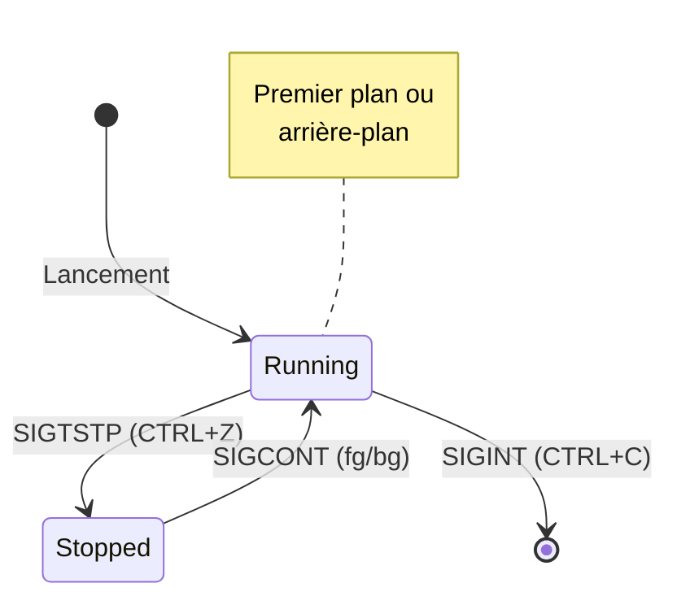

# Scénario 2 : Gestion Foreground/Background

Ce scénario vous permettra de découvrir comment Unix gère l'exécution simultanée de plusieurs processus dans un même terminal. Vous apprendrez à manipuler les processus entre le **premier plan** (*foreground*) et l'**arrière-plan** (*background*), et vous comprendrez comment le système permet cette flexibilité.

## Objectifs d'apprentissage

À la fin de ce scénario, vous serez capable de :

- Identifier visuellement l'état d'exécution d'un processus
- Manipuler les processus entre premier plan et arrière-plan
- Comprendre la différence entre suspension et contrôle de flux
- Gérer plusieurs processus simultanément

## Concepts fondamentaux

### Premier plan et arrière-plan

Pour comprendre la différence entre premier plan et arrière-plan, reprenons notre analogie du restaurant :

!!! example "L'analogie du restaurant"
    Imaginez un serveur qui s'occupe de plusieurs tables :

    - La table dont il s'occupe activement est au "premier plan" - elle a toute son attention
    - Les autres tables qu'il a en charge sont en "arrière-plan" - elles attendent leur tour
    - Le serveur ne peut s'occuper activement que d'une seule table à la fois
    - Même quand il ne s'en occupe pas, les clients des autres tables peuvent l'appeler si besoin

Dans un terminal Unix, cela se traduit ainsi :

- Un processus au **premier plan** (*foreground*) :
  - Monopolise le terminal (comme le serveur avec sa table active)
  - Reçoit les entrées clavier
  - Empêche l'utilisation du terminal pour d'autres tâches

- Un processus en **arrière-plan** (*background*) :
  - Continue de s'exécuter sans bloquer le terminal
  - Peut afficher des messages à l'écran
  - N'empêche pas l'utilisation du terminal

## Mise en pratique

### Préparation de l'environnement

1. Lancez Terminator et divisez la fenêtre en deux verticalement avec ++ctrl+shift+e++
2. Le terminal de gauche servira à lancer et manipuler nos processus
3. Le terminal de droite nous permettra d'observer leur état avec la commande `ps`

### Étape 1 : Observer la suspension d'un processus

Commençons par comprendre comment fonctionne la suspension d'un processus :

1. Dans le terminal de gauche, lancez proclab :

    ```bash
    proclab
    ```

    Prenez un moment pour observer :

    - Une fenêtre graphique s'ouvre avec un compteur qui s'incrémente
    - Le temps d'exécution augmente régulièrement
    - Le terminal est bloqué - vous ne pouvez pas y taper de commandes
    - Le processus est au premier plan


2. Maintenant, suspendez le processus avec ++ctrl+z++
    Vous verrez apparaître un message comme :

    ```
    [1]+ Stopped     proclab
    ```

    Observez attentivement ce qui se passe :

    - Le compteur dans l'interface graphique est complètement figé
    - Le temps d'exécution ne change plus
    - Le terminal est redevenu disponible
    - Le processus est suspendu (comme un serveur qui met une table en attente)

3. Vérifiez l'état du processus :

    ```bash
    jobs
    ```

    La commande affiche les processus gérés par le terminal :

    ```
    [1]+ Stopped    proclab
    ```

    Le `[1]` est le numéro de job - une identification locale au terminal.

4. Reprenez l'exécution avec :

    ```bash
    fg
    ```

    Observez la reprise :

    - Le compteur recommence à s'incrémenter
    - Le temps d'exécution reprend
    - Le terminal est à nouveau bloqué
    - Le processus est revenu au premier plan

!!! note "Comprendre la suspension"
    La suspension avec ++ctrl+z++ arrête réellement l'exécution du processus. C'est comme mettre le processus en pause complète - aucun calcul n'est effectué pendant ce temps.

### Étape 2 : Gérer plusieurs processus

Maintenant que vous avez un processus au premier plan depuis l'étape précédente, nous allons apprendre à jongler entre plusieurs processus :

1. Commencez par suspendre le processus actuel avec ++ctrl+z++
    Le terminal est libéré et vous pouvez lancer d'autres instances.

2. Lancez une deuxième instance et suspendez-la immédiatement :

    ```bash
    proclab
    # Observez la nouvelle fenêtre qui s'ouvre
    # Appuyez sur CTRL+Z
    ```

3. Lancez une troisième instance et suspendez-la aussi :

    ```bash
    proclab
    # Une troisième fenêtre apparaît
    # Appuyez sur CTRL+Z
    ```

4. Listez tous vos processus :

    ```bash
    jobs
    ```
    
    Vous devriez voir :

    ```
    [1]    Stopped    proclab
    [2]-   Stopped    proclab
    [3]+   Stopped    proclab
    ```
    
    Chaque numéro correspond à une fenêtre spécifique de proclab.

5. Reprenez le deuxième processus :

    ```bash
    fg %2
    ```

    Observez attentivement :
    - Seule la deuxième fenêtre reprend son animation
    - Les autres restent figées
    - Le terminal est bloqué par ce processus

!!! tip "Identifier les fenêtres"
    Quand vous reprenez un processus avec `fg %n`, regardez quelle fenêtre reprend son animation. Cela vous aide à comprendre la correspondance entre les numéros de jobs et les fenêtres graphiques.

### Étape 3 : Exécution en arrière-plan

Un processus suspendu peut être relancé en arrière-plan plutôt qu'au premier plan. Pour l'expérimenter :

1. Si vous avez un processus au premier plan, suspendez-le avec ++ctrl+z++

2. Listez vos processus suspendus :

    ```bash
    jobs
    ```

3. Relancez le premier processus en arrière-plan :

    ```bash
    bg %1
    ```

   Observez :

   - La fenêtre correspondante reprend son animation
   - Le terminal reste disponible
   - Vous pouvez continuer à taper des commandes

4. Vous pouvez aussi lancer directement un processus en arrière-plan :

    ```bash
    proclab &
    ```

    Le `&` à la fin de la commande indique au shell de lancer le processus directement en arrière-plan.

### Étape 4 : Comprendre le contrôle de flux

Pour cette dernière étape, nous allons découvrir une autre forme de contrôle, différente de la suspension :

1. Si vous avez des processus en cours, suspendez-les avec ++ctrl+z++

2. Lancez proclab avec l'affichage terminal activé :

    ```bash
    proclab --terminal-output
    ```

    Observez le double affichage :

    - L'interface graphique montre le compteur
    - Le terminal affiche aussi les valeurs du compteur
    - Les deux sont synchronisés

3. Appuyez sur ++ctrl+s++
    
    Observez la différence de comportement :
    
    - L'affichage dans le terminal se fige
    - L'interface graphique continue de s'actualiser
    - Le processus continue de tourner
    - Le terminal semble bloqué

4. Attendez quelques secondes (5-10) puis appuyez sur ++ctrl+q++
    
    Observez ce qui se passe :

    - Le terminal affiche soudainement toutes les valeurs du compteur qu'il n'avait pas pu montrer
    - L'interface graphique n'a jamais été affectée
    - L'affichage dans le terminal reprend normalement

!!! warning "CTRL+S vs CTRL+Z"
    Il y a une différence fondamentale :
    - ++ctrl+z++ **suspend** réellement le processus (il ne s'exécute plus du tout)
    - ++ctrl+s++ ne fait que **geler l'affichage** du terminal (le processus continue de s'exécuter)

### Étape 5 : Faire le ménage

Au fil des étapes précédentes, nous avons accumulé plusieurs fenêtres proclab suspendues. Il est temps de faire le ménage ! Pour cela, nous allons utiliser la commande `kill` avec les numéros de jobs :

1. Commencez par lister tous les processus encore présents :
    ```bash
    jobs
    ```
    Vous verrez probablement plusieurs processus proclab suspendus ou en arrière-plan.

2. Pour terminer un processus spécifique, utilisez `kill` avec le numéro de job :
    ```bash
    kill %1   # Termine le job numéro 1
    ```
    
    Observez :
    
    - La fenêtre correspondante se ferme
    - Un message indique que le job est terminé
    - Le processus disparaît de la liste des jobs

3. Répétez l'opération pour chaque job restant :
    ```bash
    kill %2   # Termine le job numéro 2
    kill %3   # Termine le job numéro 3
    # etc...
    ```

4. Vérifiez qu'il ne reste plus de processus :
    ```bash
    jobs
    ```
    La commande ne devrait plus rien afficher.

!!! warning "Importance du nettoyage"
    Dans un environnement de production, il est crucial de ne pas laisser des processus suspendus ou abandonnés. Ils consomment des ressources système et peuvent créer de la confusion. Prenez l'habitude de toujours faire le ménage après vos manipulations.

## Les signaux en jeu

Ces manipulations reposent sur différents signaux Unix :



- **SIGTSTP** (Terminal Stop) : Envoyé par ++ctrl+z++, suspend le processus
- **SIGCONT** (Continue) : Envoyé par `fg` et `bg`, reprend l'exécution
- **SIGINT** (Interrupt) : Envoyé par ++ctrl+c++, termine le processus

## Points clés à retenir

1. La suspension (++ctrl+z++) arrête réellement l'exécution du processus
2. Le contrôle de flux (++ctrl+s++/++ctrl+q++) n'affecte que l'affichage
3. Chaque terminal maintient sa propre liste de jobs
4. Un processus en arrière-plan libère le terminal
5. Les processus conservent leur état même suspendus

## Exercices pratiques

### Exercice 1 : Jonglage de processus

1. Lancez trois instances de proclab en arrière-plan avec `&`
2. Ramenez-en une au premier plan avec `fg`
3. Suspendez-la avec ++ctrl+z++
4. Vérifiez que les autres continuent en arrière-plan

### Exercice 2 : Observer les états des processus
Dans le terminal de droite, nous allons observer l'état de nos processus avec différentes options de ps :

```bash
ps aux | grep proclab
```

Observez la colonne STAT :

- 'S' indique un processus en sommeil (sleep)
- 'T' indique un processus stoppé (stopped)
- 'R' indique un processus en cours d'exécution (running)

Testez les différentes manipulations dans le terminal de gauche et observez les changements d'état :
1. Suspendez un processus avec ++ctrl+z++
2. Reprenez-le en arrière-plan avec `bg`
3. Ramenez-le au premier plan avec `fg`

## Prochaine étape

Maintenant que vous maîtrisez la gestion des processus au premier plan et en arrière-plan, nous allons explorer un état particulier : les [processus zombies](zombie.md).
