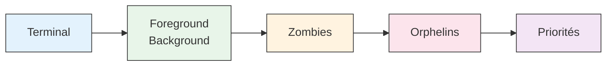

# Introduction aux activités pratiques

Les processus constituent un concept fondamental des systèmes Unix. Pour comprendre réellement leur fonctionnement, rien ne vaut la pratique ! Cette série d'activités vous guidera dans l'exploration progressive des processus, en commençant par les bases pour aller jusqu'aux concepts plus avancés.

## Vue d'ensemble

Au fil des activités, vous découvrirez différents aspects de la gestion des processus sous Unix. Chaque scénario est conçu pour vous faire explorer un concept spécifique de manière pratique et interactive.

## Les scénarios

### Scénario 1 : Terminal et processus

Découvrez comment les processus interagissent avec leur terminal. Vous apprendrez à :

- Identifier les terminaux et leurs processus
- Comprendre la relation entre un processus et son terminal
- Observer les processus avec différentes commandes

### Scénario 2 : Gestion foreground/background

Explorez comment gérer plusieurs processus dans un même terminal :

- Mettre un processus en pause avec ++ctrl+z++
- Basculer entre avant-plan et arrière-plan
- Manipuler plusieurs processus simultanément

### Scénario 3 : Les processus zombies

Plongez dans le monde mystérieux des processus zombies :

- Comprendre ce qu'est un processus zombie
- Observer comment ils se créent
- Apprendre à les gérer proprement

### Scénario 4 : Les processus orphelins

Découvrez ce qui arrive quand un processus perd son parent :

- Comprendre le concept de processus orphelin
- Observer le rôle de init/systemd
- Suivre la réaffectation des processus

### Scénario 5 : Les priorités

Explorez la gestion des priorités des processus :

- Comprendre le système de priorités
- Modifier la priorité des processus
- Observer l'impact sur leur exécution

## Comment utiliser ces activités

### Progression recommandée

Les scénarios sont conçus pour être suivis dans l'ordre. Chaque activité s'appuie sur les connaissances acquises dans les précédentes.

!!! tip "Conseils pour bien progresser"
    - Prenez le temps de bien comprendre chaque concept avant de passer au suivant
    - N'hésitez pas à expérimenter au-delà des instructions données
    - Utilisez l'aide contextuelle de proclab (SIGUSR1/SIGUSR2) si vous êtes bloqué

### Ressources disponibles

Pour chaque activité, vous disposez de :

- Instructions détaillées pas à pas
- Explications des concepts clés
- Commandes de référence
- Visualisations et diagrammes

### Support théorique

En parallèle des activités pratiques, vous pouvez consulter :

- [L'analogie du restaurant](../ressources/analogie-restaurant.md) pour une vision intuitive
- [La documentation sur les processus](../ressources/processus.md) pour les détails techniques
- [Les informations sur les signaux](../ressources/signaux.md) pour comprendre les communications

## Prêt à commencer ?

[Démarrez avec le premier scénario →](terminal.md)
{: .md-button .md-button--primary }
