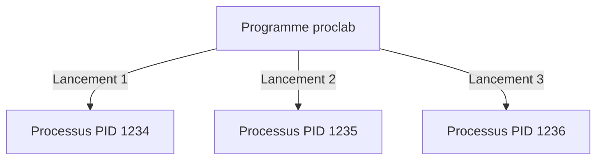
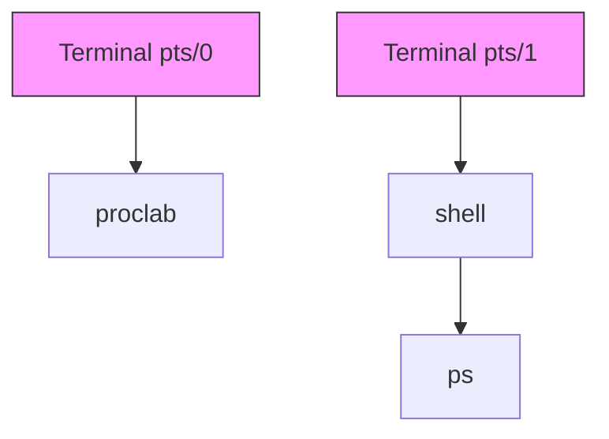

# Scénario : Terminal et processus

Dans ce premier scénario, nous allons explorer la relation entre les terminaux et les processus sous Linux. Vous découvrirez comment les processus sont liés à leur terminal de contrôle et comment observer ces relations.

## Objectifs d'apprentissage

À la fin de ce scénario, vous serez capable de :

- Identifier le terminal associé à un processus
- Comprendre la notion de terminal de contrôle
- Maîtriser les options de base de la commande `ps`

## Concepts fondamentaux

### Qu'est-ce qu'un processus ?

Un **processus** (*process*) est un programme en cours d'exécution. Mais cette définition technique ne suffit pas à comprendre ce concept essentiel. Prenons une première analogie simple pour commencer :

Dans un restaurant, chaque table occupée représente un processus différent :

- La table a son propre espace (la mémoire allouée au processus)
- Les clients ont leur propre commande (les instructions du programme)
- Chaque table a un numéro unique (comme le PID - *Process IDentifier*)

!!! note "Une analogie qui va s'enrichir"
    Cette image du restaurant va s'enrichir au fil des scénarios. Nous verrons comment l'organisation complète d'un restaurant (serveurs, maître d'hôtel, chef de salle...) nous aide à comprendre la gestion des processus dans son ensemble. Si vous êtes curieux, vous pouvez déjà consulter [l'analogie complète du restaurant](../ressources/analogie-restaurant.md), mais ne vous inquiétez pas si certains concepts ne sont pas encore clairs - nous les découvrirons progressivement.

En informatique, lorsque vous lancez un programme comme `firefox` ou notre `proclab`, le système d'exploitation :

1. Crée un nouvel espace en mémoire
2. Attribue un numéro unique (PID) au processus
3. Charge le programme dans cet espace
4. Commence son exécution

!!! example "Exemple concret"
    Quand vous lancez trois fois `proclab`, vous créez trois processus distincts :

    - Chacun a son propre PID
    - Chacun s'exécute indépendamment
    - Chacun a sa propre zone mémoire



### Le terminal de contrôle

Un **terminal de contrôle** (*controlling terminal*) est l'interface par laquelle un utilisateur interagit avec un processus. Sous Linux, chaque processus est généralement associé à un terminal qui lui permet de :

- Recevoir les entrées de l'utilisateur (clavier)
- Afficher ses sorties (écran)
- Recevoir des signaux de contrôle (comme ++ctrl+c++)

!!! info "Les terminaux physiques et virtuels"
    Historiquement, un terminal était un appareil physique (comme un téletype). Aujourd'hui, nous utilisons des **terminaux virtuels** (*virtual terminals*) ou des **émulateurs de terminal** (*terminal emulators*) qui simulent le comportement des terminaux physiques.

## Mise en pratique

### Préparation de l'environnement

1. Lancez Terminator et divisez la fenêtre en deux parties verticales (++ctrl+shift+e++)
2. Dans chaque partie, vous aurez un terminal distinct avec son propre identifiant

### Étape 1 : Identifier son terminal

Dans chaque terminal, exécutez la commande :

```bash
tty
```

Cette commande affiche le chemin du périphérique terminal. Vous obtiendrez quelque chose comme `/dev/pts/0` pour le premier terminal et `/dev/pts/1` pour le second.

!!! tip "Comprendre la sortie"
    Le préfixe `/dev/pts/` indique qu'il s'agit d'un pseudo-terminal (*pseudo-terminal slave*), une émulation logicielle d'un terminal physique.

### Étape 2 : Observer les processus

Ouvrons d'abord le premier terminal. Nous allons lancer `proclab` en arrière-plan en utilisant le symbole `&` :

```bash
proclab &
```

Quand nous ajoutons `&` à la fin d'une commande, nous demandons au shell de lancer le programme sans bloquer notre terminal. Normalement, quand vous lancez un programme comme `proclab`, votre terminal est monopolisé jusqu'à ce que le programme se termine — vous ne pouvez plus taper de commandes. Avec `&`, le terminal reste disponible : vous retrouvez immédiatement l'invite de commande et pouvez continuer à l'utiliser pendant que proclab s'exécute en parallèle.

Maintenant, vérifions quels processus sont visibles dans ce terminal :

```bash
ps
```

Vous devriez voir une sortie similaire à celle-ci :

```bash
$ ps
    PID TTY          TIME CMD
   2019 pts/0    00:00:00 bash
   7180 pts/0    00:00:33 proclab
   8099 pts/0    00:00:00 ps
```

Cette commande nous montre trois processus :

- bash : le shell qui contrôle notre terminal
- proclab : notre programme qui s'exécute en arrière-plan
- ps : la commande que nous venons de lancer

### Étape 3 : Voir les processus des autres terminaux

Passons maintenant au second terminal et exécutons la même commande :

```bash
ps
```

Cette fois, la sortie est différente :

```bash
$ ps
    PID TTY          TIME CMD
   6584 pts/1    00:00:00 bash
   8035 pts/1    00:00:00 ps
```

Nous ne voyons plus proclab ! C'est normal : par défaut, `ps` ne montre que les processus du terminal courant. Pour voir les processus de tous les terminaux, nous pouvons utiliser l'option `-a` :

!!! note "Observation importante"
    Cette expérience nous montre que :
    - Chaque terminal ne voit que ses propres processus. Vous ne verrez pas les processus du premier terminal dans le second, et vice versa.
    - La colonne TTY nous indique le terminal de contrôle de chaque processus
    - Un processus reste attaché à son terminal même en arrière-plan

Dans le second terminal, exécutez :

```bash
ps -a
```

Cette fois, nous obtenons :

```
    PID TTY          TIME CMD
   7180 pts/0    00:11:09 proclab
   8730 pts/1    00:00:00 ps
```

!!! note "Où est passé bash ?"
    Vous remarquez que bash n'apparaît plus dans cette liste ? L'option `-a` montre les processus de tous les terminaux, mais exclut volontairement les processus « meneurs de session » comme bash. Ces processus spéciaux gèrent chaque terminal et sont toujours présents, c'est pourquoi ps les filtre par défaut pour plus de clarté.

## Visualisation de la relation terminal-processus



## Points clés à retenir

La relation entre un terminal et ses processus est fondamentale sous Unix :

1. Chaque terminal a un identifiant unique (`/dev/pts/X`)
2. Les processus héritent du terminal de leur parent
3. La commande `ps` permet d'observer ces relations
4. Un terminal peut contrôler plusieurs processus

## Pour aller plus loin

Vous avez maintenant acquis les bases de la relation entre terminaux et processus sous Linux. Ces connaissances sont essentielles pour comprendre les concepts plus avancés de la gestion des processus que nous allons explorer dans les prochains scénarios.
