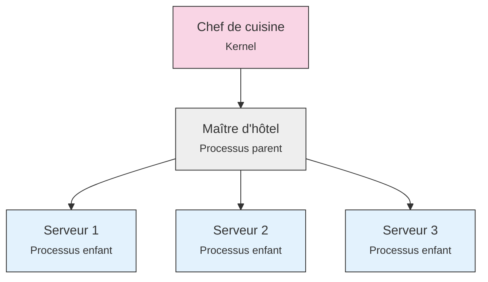

# Comprendre les processus Unix avec l'analogie du restaurant

Imaginez un grand restaurant en pleine activité, avec ses serveurs qui s'affairent, son maître d'hôtel qui coordonne le service, et son chef de cuisine qui supervise toute l'organisation. Cette image familière nous servira de guide pour comprendre un des concepts les plus importants des systèmes Unix : les processus et leur gestion.

!!! tip "Comment tirer le meilleur parti de cette analogie"
    Cette page est une référence que vous pouvez consulter à tout moment. Au fil de vos exercices pratiques, revenez-y pour faire le lien entre ce que vous observez et les situations décrites ici. Les concepts abstraits deviendront plus concrets grâce à ces images mentales.

## La structure du restaurant

### Le restaurant : notre système d'exploitation

Comme un système d'exploitation gère de nombreux processus, un restaurant gère de multiples activités en parallèle. Dans cette analogie :

!!! example "Les correspondances clés"
    💻 Le **restaurant** correspond au *système d'exploitation*  
    👨‍🍳 Le **chef de cuisine** représente le *kernel* (noyau)  
    📋 Le **carnet des commandes** est la *table des processus*

### Les acteurs et leurs rôles

Le personnel du restaurant nous aide à comprendre la hiérarchie des processus :

Chaque serveur, comme chaque processus, possède :

- Un numéro unique d'identification (comme le PID)
- Un niveau d'expérience (comme la priorité d'exécution)
- Des tâches assignées (comme les instructions à exécuter)

## Les états d'un serveur

Un serveur, tout comme un processus, peut se trouver dans différents états au cours de son service.

### En activité (Running)

Lorsqu'un serveur s'occupe activement de ses tables, il est comme un processus en cours d'exécution. Il :

- Prend les commandes
- Sert les plats
- Interagit avec les clients

### En pause (Stopped)

Quand un serveur prend sa pause cigarette, il est temporairement arrêté, comme un processus suspendu par ++ctrl+z++. Il :

- N'est plus en salle
- Peut être rappelé si nécessaire
- Conserve la mémoire de ses tables

### Cas particuliers

=== "Le serveur zombie"
    Un serveur qui a terminé son service mais attend la validation de ses comptes par le maître d'hôtel est comme un processus zombie. Il ne travaille plus mais occupe encore une place dans le système.

=== "Le serveur orphelin"
    Quand le maître d'hôtel part sans prévenir, les serveurs deviennent orphelins. Le chef de salle (comme init) doit alors prendre le relais pour superviser ces serveurs.

## La communication par signaux

Dans un restaurant, les ordres et les communications sont essentiels, tout comme les signaux dans un système Unix.

### Les ordres quotidiens

| Signal restaurant | Équivalent Unix | Description |
|------------------|-----------------|-------------|
| "Au service !" | SIGCONT | Reprise du travail |
| "Pause !" | SIGTSTP | Interruption temporaire |
| "Fin de service !" | SIGTERM | Terminer proprement |

### Les urgences

| Signal urgent | Équivalent Unix | Description |
|--------------|-----------------|-------------|
| "URGENCE !" | SIGINT (++ctrl+c++) | Interruption immédiate |
| "DEHORS !" | SIGKILL | Arrêt forcé sans discussion |

## Application pratique

Cette analogie prend tout son sens au fil des scénarios d'apprentissage :

!!! abstract "Dans les scénarios"
    🍽️ [Scénario 2](../activites/fg-bg.md) : Gestion salle/bar comme foreground/background  
    👻 [Scénario 3](../activites/zombie.md) : Les serveurs zombies  
    🤔 [Scénario 4](../activites/orphelin.md) : Quand le maître d'hôtel disparaît  
    ⭐ [Scénario 5](../activites/priorites.md) : L'expérience des serveurs

!!! tip "Conseils d'utilisation"
    - Revenez consulter cette page après chaque scénario
    - Faites le lien avec vos observations pratiques
    - Utilisez ces images pour expliquer les concepts à vos pairs
