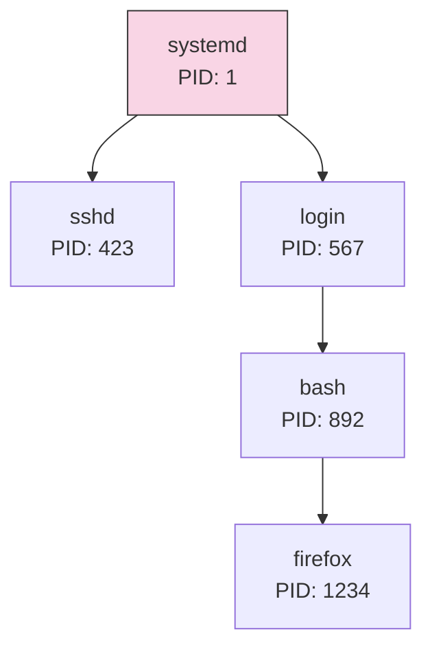
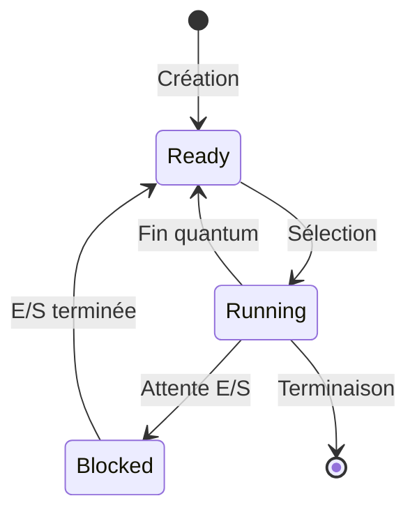
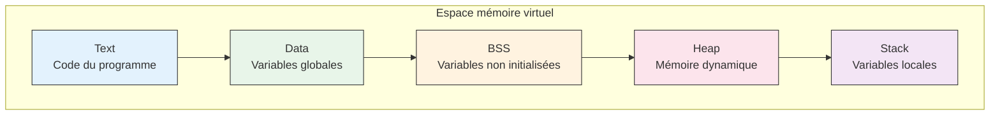

# Les processus sous Unix

Un système d'exploitation Unix gère de nombreux programmes en cours d'exécution simultanément. Pour comprendre comment cela fonctionne, nous devons d'abord comprendre ce qu'est un processus et comment il est géré par le système.

## Introduction aux processus

### Définition et rôle

Un **processus** (*process*) est un programme en cours d'exécution. Cette définition simple cache une réalité plus complexe : un processus est en fait un environnement d'exécution complet qui comprend :

- Le code du programme à exécuter
- Les données en cours de traitement
- Les ressources système allouées
- Le contexte d'exécution (registres CPU, compteur ordinal, etc.)

!!! example "Programme vs Processus"
    Un même **programme** peut donner naissance à plusieurs **processus** différents :
    - Le programme Firefox est stocké sur le disque dur
    - Chaque fois que vous lancez Firefox, un nouveau processus est créé
    - Vous pouvez avoir plusieurs processus Firefox en même temps
    - Chaque processus a son propre espace mémoire et ses propres ressources

### Identification des processus

Chaque processus possède un identifiant unique appelé **PID** (*Process IDentifier*). C'est un nombre entier attribué séquentiellement par le système :

- Le processus *init* (ou *systemd* sur les systèmes modernes) a toujours le PID 1
- Les PID sont réutilisés quand un processus se termine
- Chaque processus connaît aussi le PID de son parent (**PPID** - *Parent Process IDentifier*)

## Cycle de vie d'un processus

### Création d'un processus

Sous Unix, les processus sont créés par **duplication** (*fork*) :

1. Un processus existant se clone lui-même
2. Le clone (processus enfant) a son propre PID
3. L'enfant hérite des ressources du parent
4. L'enfant peut ensuite charger un nouveau programme (*exec*)

### États d'un processus

Un processus peut se trouver dans différents états au cours de son existence :

- **Prêt** (*Ready*) : Attend son tour d'exécution
- **En cours** (*Running*) : S'exécute sur le processeur
- **Bloqué** (*Blocked*) : Attend une ressource ou un événement
- **Zombie** (*Zombie*) : Terminé mais non nettoyé
- **Arrêté** (*Stopped*) : Suspendu temporairement

!!! note "L'importance de l'ordonnancement"
    Le système d'exploitation doit partager équitablement le processeur entre tous les processus prêts. C'est le rôle de l'**ordonnanceur** (*scheduler*) qui décide quel processus exécuter et pendant combien de temps.

## Hiérarchie des processus

### Relations parent-enfant

Les processus Unix sont organisés de manière hiérarchique :

- Chaque processus (sauf init) a un parent
- Un processus peut avoir plusieurs enfants
- Quand un parent meurt, ses enfants sont adoptés par init
- Les processus frères (*siblings*) partagent le même parent

### Propagation des signaux

La hiérarchie influence la propagation des signaux :

- Certains signaux remontent vers le parent
- D'autres descendent vers les enfants
- Le parent est responsable de la terminaison de ses enfants

## Environnement d'exécution

### Espace mémoire

Chaque processus dispose de son propre espace mémoire virtuel :

### Descripteurs de fichiers

Les processus interagissent avec l'extérieur via des descripteurs de fichiers :

- stdin (0) : Entrée standard
- stdout (1) : Sortie standard
- stderr (2) : Sortie d'erreur
- Autres descripteurs pour les fichiers ouverts

## Gestion des ressources

### Priorités d'exécution

Les processus peuvent avoir différentes priorités :

- La **priorité statique** (*nice value*) est définie au lancement
- La **priorité dynamique** évolue selon l'utilisation du CPU
- Les processus système ont généralement une priorité plus élevée

### Limites de ressources

Un processus est soumis à diverses limites :

- Taille maximale de fichier
- Nombre de fichiers ouverts
- Quantité de mémoire utilisable
- Temps CPU disponible

!!! tip "Visualiser les limites"
    La commande `ulimit -a` permet de voir les limites actuelles du shell.

## Outils de gestion des processus

Pour interagir avec les processus, Unix fournit plusieurs commandes essentielles :

### Observation des processus

- `ps` : Liste des processus
- `top` : Surveillance en temps réel
- `pstree` : Affichage hiérarchique

### Contrôle des processus

- `kill` : Envoi de signaux
- `nice` / `renice` : Gestion des priorités
- `bg` / `fg` : Gestion avant/arrière plan

!!! warning "Utilisation de kill"
    Bien que son nom suggère la terminaison, `kill` sert en fait à envoyer n'importe quel signal à un processus. `kill -l` liste tous les signaux disponibles.

## Pour aller plus loin

### Lectures recommandées

- "Advanced Programming in the UNIX Environment" de W. Richard Stevens
- "Understanding the Linux Kernel" de Daniel P. Bovet
- La page man de `proc(5)` pour les détails sur /proc

### Concepts avancés à explorer

- Les threads et la programmation multithread
- La communication inter-processus (IPC)
- Les conteneurs et la virtualisation
