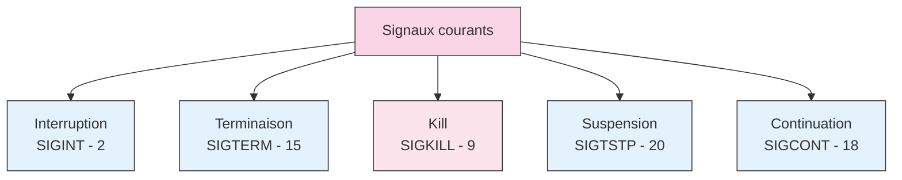
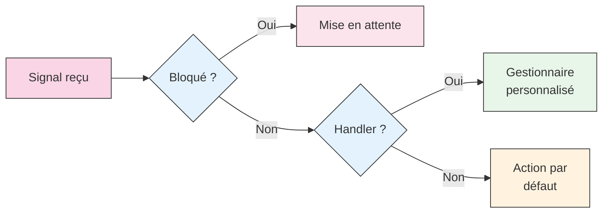

# Les signaux sous Unix

Les signaux sont un mécanisme fondamental de communication entre processus sous Unix. Imaginez-les comme un système d'alerte ou de notification qui permet d'informer les processus d'événements importants ou de leur demander d'effectuer certaines actions.

## Comprendre les signaux

### Qu'est-ce qu'un signal ?

Un **signal** (*signal*) est une forme d'interruption logicielle envoyée à un processus pour lui notifier un événement. C'est un peu comme si vous tapiez sur l'épaule de quelqu'un pour attirer son attention : le processus interrompt son activité normale pour "regarder" ce qu'on lui veut.

!!! example "Les signaux au quotidien"
    Vous utilisez déjà les signaux sans le savoir ! Quand vous appuyez sur ++ctrl+c++ dans un terminal, vous envoyez un signal SIGINT au processus en cours. C'est une façon polie de lui dire "S'il te plaît, arrête-toi".

### Caractéristiques des signaux

Les signaux ont plusieurs propriétés importantes :

1. **Asynchrones** : Ils peuvent arriver à n'importe quel moment
2. **Limités** : Ils ne transportent pas de données, juste un numéro
3. **Non empilés** : Un même signal répété pendant le traitement du premier est ignoré
4. **Configurables** : Un processus peut choisir comment réagir à la plupart des signaux

## Les signaux standard

### Les signaux les plus courants



| Signal | Numéro | Description | Raccourci |
|--------|---------|-------------|-----------|
| SIGINT | 2 | Interruption interactive | ++ctrl+c++ |
| SIGTERM | 15 | Terminaison propre | - |
| SIGKILL | 9 | Terminaison forcée | - |
| SIGTSTP | 20 | Suspension | ++ctrl+z++ |
| SIGCONT | 18 | Reprise d'exécution | - |

### Les signaux du clavier

Le terminal traduit certaines combinaisons de touches en signaux :

!!! tip "Voir les raccourcis configurés"
    La commande `stty -a` affiche tous les raccourcis clavier configurés dans votre terminal.
    ```bash
    stty -a
    ```

### Comportements spéciaux

Certains signaux ont des particularités importantes :

=== "SIGKILL et SIGSTOP"
    Ces signaux ne peuvent pas être ignorés ou interceptés par les processus. Ils sont l'équivalent d'un arrêt d'urgence.

=== "SIGCHLD"
    Envoyé au parent quand un processus enfant se termine. Crucial pour éviter les processus zombies.

=== "SIGUSR1 et SIGUSR2"
    Signaux laissés à la disposition des programmeurs pour un usage personnalisé.

## Gestion des signaux

### Comment envoyer un signal

La commande `kill` permet d'envoyer n'importe quel signal à un processus :

```bash
# Syntaxe : kill -signal pid
kill -TERM 1234    # Envoie SIGTERM au processus 1234
kill -9 1234       # Envoie SIGKILL (force l'arrêt)
```

!!! warning "Le nom trompeur de kill"
    Malgré son nom, `kill` n'est pas uniquement destiné à terminer des processus. C'est un outil général d'envoi de signaux.

### Réception des signaux

Quand un processus reçoit un signal, plusieurs scénarios sont possibles :

1. **Action par défaut** : Comportement standard du système
2. **Gestionnaire personnalisé** : Le processus traite le signal à sa façon
3. **Ignorance** : Le processus peut ignorer certains signaux
4. **Blocage** : Le processus peut temporairement bloquer des signaux



## Utilisation pratique des signaux

### Cas d'usage courants

Les signaux sont utilisés dans de nombreuses situations :

1. **Contrôle de processus**
   - Arrêt propre (SIGTERM)
   - Arrêt forcé (SIGKILL)
   - Suspension/reprise (SIGTSTP/SIGCONT)

2. **Gestion des démons**
   - Rechargement de configuration (SIGHUP)
   - Rotation des logs (SIGUSR1)

3. **Débogage**
   - Interruption pour inspection (SIGSTOP)
   - Reprise d'exécution (SIGCONT)

### Bonnes pratiques

Pour une gestion efficace des signaux :

1. Préférez SIGTERM à SIGKILL pour terminer un processus
2. Gérez proprement SIGCHLD pour éviter les zombies
3. Documentez l'utilisation de SIGUSR1/SIGUSR2
4. Pensez à sauvegarder les données avant de terminer

!!! tip "Diagnostic avec strace"
    La commande `strace` permet de voir les signaux reçus par un processus :
    ```bash
    strace -e signal ./monprogramme
    ```

## Dans nos exercices pratiques

Au cours des différents scénarios, vous rencontrerez plusieurs situations impliquant des signaux :

!!! abstract "Utilisation des signaux"
    🎮 [Scénario 2](../activites/fg-bg.md) : Utilisation de SIGTSTP et SIGCONT  
    👻 [Scénario 3](../activites/zombie.md) : Gestion de SIGCHLD  
    🤖 [Programme proclab](../activites/terminal.md) : Utilisation de SIGUSR1/SIGUSR2 pour l'aide

## Pour aller plus loin

### Documentation système

- `man 7 signal` : Liste complète des signaux
- `man 2 signal` : Programmation des gestionnaires
- `man 2 sigaction` : Interface moderne de gestion

### Concepts avancés

- Les masques de signaux
- Les ensembles de signaux (sigset)
- Les signaux temps réel
- La gestion des signaux dans les threads
